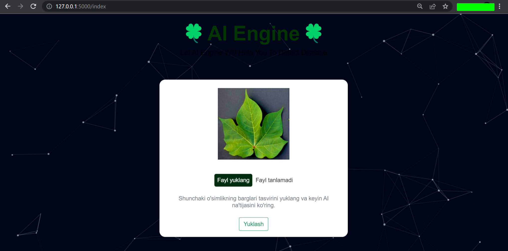

## Plant Disease Classification APP

### Abstract 
The main goal of this project is to classify the plant leaf images into different categories using Convolutional Neural Networks. We will be using a custom dataset of plant leaves with various diseases and conditions. The dataset includes images of healthy leaves, as well as leaves with different types of diseases and pests.

### Introduction
Plant disease is a major concern for the agriculture industry, as it can lead to significant yield loss and reduced quality of crops. Early detection and identification of plant diseases is crucial for effective management and control. Convolutional Neural Networks (CNNs) have shown great success in image classification tasks, and we aim to leverage this technology for plant disease classification.

### Dataset
Example dataset : https://www.kaggle.com/datasets/seroshkarim/cotton-leaf-disease-dataset

### Technologies
- Python
- Pytorch
- NumPy
- Pandas
- CNN
- VGG19


### How to run the app
1. Clone the repository
2. Install the dependencies

```
pip install -r requirements.txt
```
3. Train the model using the Cotton Disease Detection Project-FINAL.ipynb notebook
4. Download the dataset. Example dataset : https://www.kaggle.com/datasets/seroshkarim/cotton-leaf-disease-dataset
5. Put the dataset in /server/data/cotton_infection_dir_ready
6. Save the model
7. Copy the model to /server folder 
8. Run the app

```
python app.py
```

### How to use the app
1. Upload an image of example plant leaf from internet or /server/saved_images_from_internet
2. Click on the "Predict" button
3. The app will display the predicted class of the plant leaf




### Architecture
The app is built using Python and Flask for the backend for the frontend. The model will be trained in the Cotton Disease Detection Project-FINAL.ipynb notebook 
and the saved model will be saved in /server folder. The app will be run in /server folder.

### Application Architecture


### Web application architecture


### Results

